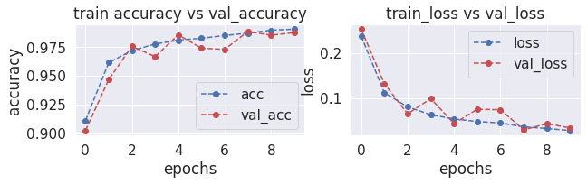
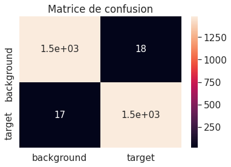

# Test technique Airbus 2021 pour une alternance computer vision de deux années

Le but de ce projet était de construire un modèle convolutif personnalisé (CNN) permettant d'atteindre une performance de classification d'images contenant une éolienne avec une précision de plus de 99% en moins de 10 epochs. Une base de données privée, fournie par Airbus et contenant 400 000 images satellitaires, a été utilisée pour ce projet. Celui-ci a été réalisé sur Kaggle.

Choix "metrics" : 
-----------------
Mon objectif est de surveiller la précision du modèle et s'assurer qu'il n'y a ni d' "overfitting" ou d' "underfitting". Le meilleur choix est donc : Accuracy qui calcul à quel point le modèle a réussi.

Accuracy: Calcule la fréquence à laquelle les prédictions égalent les vraies valeurs.

Choix "learning_size" : j'ai constaté ces résultats 
-----------------------
learning_size € ]0 ; 1[

le "learning_size" contrôle la rapidité avec laquelle le modèle est adapté au problème.

Un petit taux d'apprentissage nécessite plus d' "epochs".
Un taux d'apprentissage élevé, entraîne des changements rapide et nécessite moins d'époques.
Un taux d'apprentissage "trop" élevé peut amener le modèle à converger trop rapidement vers une solution non-optimale.
Comme on a 10 époques, notre espace de recherche peut se réduire à [0.0001 ; 0.01]

Meilleur choix(après quelques essais) ==> learning_rate=0.0005

Choix "batch_size" : 
--------------------
batch_size = 32 (par défaut)

batch_size large = entraînement rapide et vice versa
Plus grand est le batch_size plus grand sera le learning rate
batch_size < taille entrainement(10 500)/batch_size <==> batch_size =<100

Donc batch_size € [1 ; 100]

Après quelques essai, j'ai constaté que le meilleur batch_size = 32.

Propositions d'amélioration pour les images mal classifiées :
-------------------------------------------------------------
- Je pense que l'augmentation du constrast peut beaucoup aider à mieux classifier les images.
Une meilleure luminance.
- On peut aussi passer les photos en noir et blanc, cela peut beaucoup améliorer la rapidité du traitement.
- Augmenter les données (pivoter les images, modifier la luminance..etc)

## Résultats :

